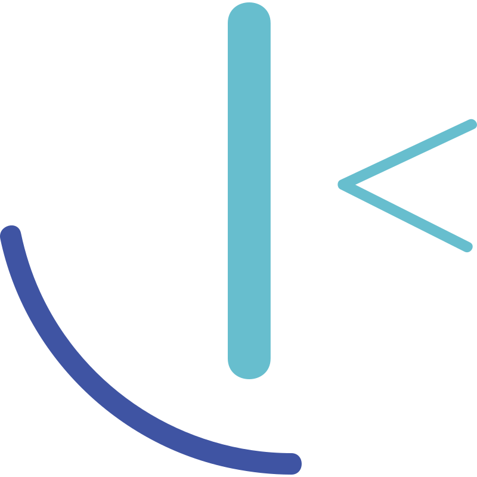

	
	<h1 align="center">Skilled e-learning landing page</h1>
	

		Frontend Mentor Challenge
	

	

		
		
	

	

		<a href="https://skilled-e-learning-landing-page-sigma.vercel.app/">View Demo</a> ·
		<a href="https://www.frontendmentor.io/challenges/skilled-elearning-landing-page-S1ObDrZ8q/hub/skilled-elearning-landing-page-QD3uF6eQFP"> View on frontend mentor</a>
	

	

		
	

## My process

### Built with

-   [Vite](https://vitejs.dev/) - development environment
-   [Sass](https://sass-lang.com/) - CSS preprocessor
-   [PostCSS](https://postcss.org/) - CSS postprocessor
-   [Pug](https://pugjs.org/api/getting-started.html) - HTML preprocessor
-   [Eslint](https://eslint.org/) - linter
-   [Prettier](https://prettier.io/) - code formatter

### What I learned

-   Interaction for `linear-gradient`
-   new GSAP animation pattern
-   Pug Structuring

### Continued development

-   Image compression flow using @squoosh/lib
-   CSS Interaction
-   BEM, CSS Structuring
-   SASS Mixin
-   GSAP Animation
-   CSS Grid
-   Svg icons
-   Switch favicon between dark and light modes
-   Displaying webfont using webfont loader
-   Issue-driven development
